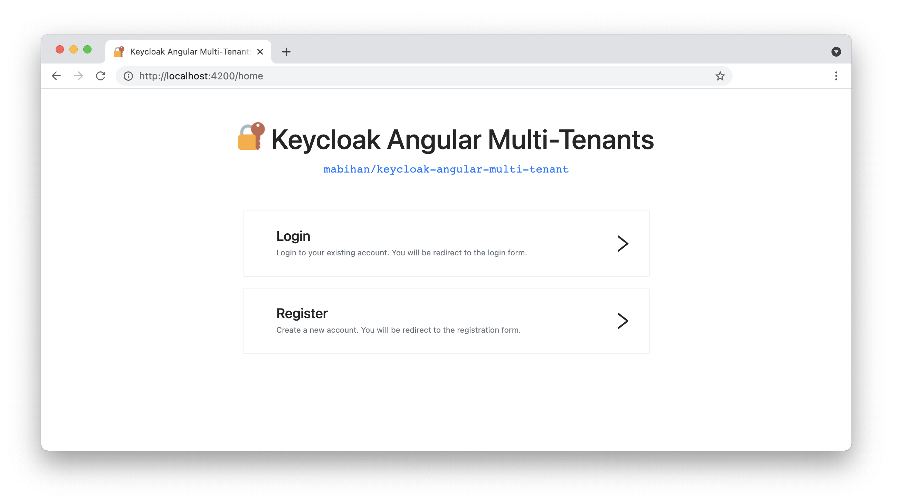

# 🔐 Keycloak Angular Multi-Tenants Example

This example projects demonstrates a multi-tenants setup of Keycloak Angular together with an actual Keycloak server . 
It can be used for testing and development purposes as well as a guideline on how to use Keycloak Angular in your own 
projects. **This project has been created from the example given in the 
[keycloak-angular repo](https://github.com/mauriciovigolo/keycloak-angular/tree/master/example) from 
[mauriciovigolo](https://github.com/mauriciovigolo/)**.

What you'll get : 
- A Keycloak server configured with 3 realms
- An Angular client allowed to login / register on these 3 realms



To run this project make sure you have [Angular CLI](https://cli.angular.io/) and 
[Docker](https://www.docker.com/) installed on your system.

# 🛫 Running the application

## Keycloak server setup
To start the Keycloak server run `docker-compose up` in the same directory as this README file.
You can administrate the Keycloak server by navigating to http://localhost:8080/. The default username and password will 
both be `admin`.

## Starting Angular frontend
You can start the client application by running the commands : 

````shell
yarn install
yarn start
````
Client will be available on http://localhost:4200/ just like any other Angular CLI application.

# ✅ Todos
- Fix connection problem after Angular dev server refresh
- Improve `isLoggedInWithDelay`function (today we wait n milliseconds)
- Validate / tweak client configuration
